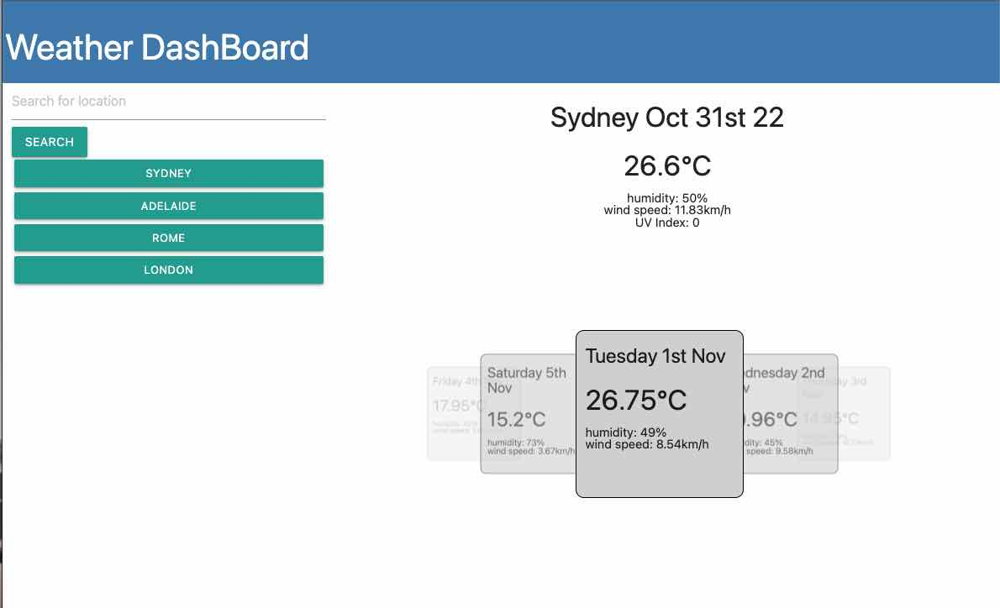

# Weather-Dashboard
Bootcamp WK06 Challange


## Link to live site
[Weather DashBoard](https://kokkonut.github.io/Weather-Dashboard/)

## Link to repo
[Repo](https://github.com/Kokkonut/Weather-Dashboard)

## Instalation
none

## Notes
This is pretty much the MVP version for this task, the price of leaving things to the last minute.

## Issues
UV index not updating styles dynamicly.
Not using live weather Icons.

## Future Updates
This version was built using bit of code from previous projects, so I was unable to fully implement desired features.
Next version will require a full rebuild of the js (excluding the fetch functions, they were good).

## Screnshot



## Your Task

Third-party APIs allow developers to access their data and functionality by making requests with specific parameters to a URL. Developers are often tasked with retrieving data from another application's API and using it in the context of their own. Your challenge is to build a weather dashboard that will run in the browser and feature dynamically updated HTML and CSS.

Use the [OpenWeather One Call API](https://openweathermap.org/api/one-call-api) to retrieve weather data for cities. Read through the documentation for setup and usage instructions. You will use `localStorage` to store any persistent data. For more information on how to work with the OpenWeather API, refer to the [Full-Stack Blog on how to use API keys](https://coding-boot-camp.github.io/full-stack/apis/how-to-use-api-keys).

## User Story

```
AS A traveler
I WANT to see the weather outlook for multiple cities
SO THAT I can plan a trip accordingly
```